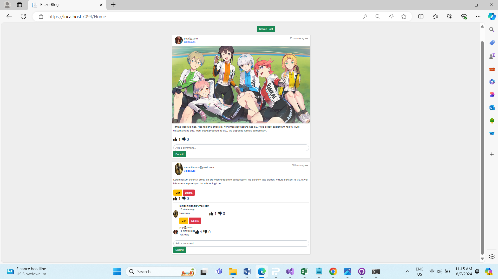

# BlazorBlog

## Description
This is my project description.

## Screenshots

### Homepage

### Dashboard

# MyStore

MyStore is an online shopping application with the following features...

## Screenshots

### Home Page

### Register

### Login

### Cart Page

### Cart Items

### Order Complete

### Order Summary

### Admin Products

### Admin Edit

### Admin Details

### Create Create

